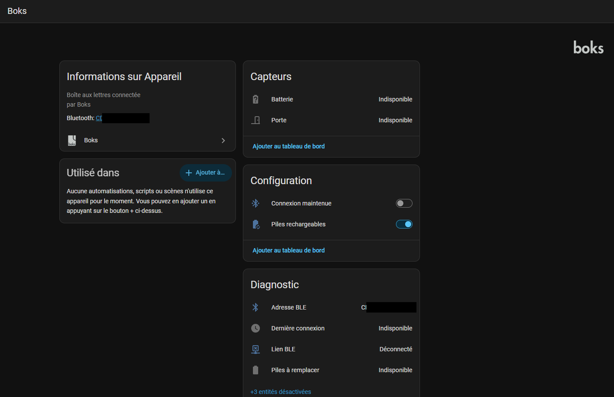

> 🇫🇷 **[Version française](docs/fr/README.md)**

# Boks for Home Assistant

Your **Boks** mailbox, talking directly to Home Assistant: the door state
lands the instant it changes, not on the next poll, and none of it goes
through the vendor's cloud.

New here? The **[Quick guide](Quick-guide.md)** gets a mailbox up and running
in five steps. This README covers the full picture — trade-offs, several
mailboxes, troubleshooting.

Installable through [HACS](https://hacs.xyz/). **Read-only by default** —
remote opening is opt-in, see [Scope](#scope).

| Entity | Type | Notes |
|---|---|---|
| Door | `binary_sensor` (`door`) | pushed by the mailbox on every change |
| Open | `button` | **only if an open code is configured** — see [Opening the door](#opening-the-door) |
| Battery | `sensor` (%) | pushed on change, read on connect |
| Battery low | `binary_sensor` (`battery`) | diagnostic — **use this, not the percentage** ([why](#battery-alkaline-vs-regulated-cells)) |
| Hold connection | `switch` | config — see [Holding the link](#holding-the-link) |
| Rechargeable batteries | `switch` | config — declares the cell type in place |
| BLE link | `binary_sensor` (`connectivity`) | diagnostic |
| Last connected | `sensor` (timestamp) | diagnostic — how fresh the values above are |
| BLE address | `sensor` | diagnostic |
| Last VIGIK opening | `sensor` (timestamp) | diagnostic — see [Opening history](#opening-history) |
| Last badge opening | `sensor` (timestamp) | diagnostic — see [Opening history](#opening-history) |
| Last code opening | `sensor` (timestamp) | diagnostic — see [Opening history](#opening-history) |
| RSSI | `sensor` (dBm) | diagnostic, disabled by default |
| Firmware / Software | `sensor` | diagnostic, disabled by default |



> Home Assistant splits the device page by entity category: *Sensors* first,
> then *Configuration* (the two switches), then *Diagnostic*. The two switches
> are **not** in the Controls block — that block only holds uncategorised
> entities.

## Scope

**Read-only by default.** Out of the box the only frames transmitted are
**status requests**, which double as the keepalive described below. No owner
credentials are required or used, and no `button` entity is created.

**Opening is opt-in.** If — and only if — you enter an open code in the
options, an **Open** button appears and the integration may additionally send
`OPEN_DOOR`. Nothing else ever becomes possible: the frame builder *refuses*
every other opcode by construction, so code management (16–19), configuration
changes (22) and provisioning (32–33) remain unreachable, not merely unused.

> Entering a code means **anyone with access to your Home Assistant can open
> your mailbox**. The code is stored in the config entry, in clear text like
> every other Home Assistant credential. Leave the field empty to keep the
> integration strictly read-only.

See [Opening the door](#opening-the-door).

## Requirements

1. **A Bluetooth proxy or adapter in range of the mailbox**, declared in Home
   Assistant. A proxy running the **NimBLE** stack is strongly recommended —
   see [Why NimBLE](#why-nimble). This repository ships a
   [ready-to-build firmware](firmware/nimble-ble-proxy/) and its
   [build guide](firmware/nimble-ble-proxy/README.md).
2. **The official vendor dongle must be unplugged.** It holds a permanent BLE
   connection to the mailbox, which makes the mailbox invisible to every other
   client, including this integration.

## Installation

### 1. Firmware (once)

Build and flash the Bluetooth proxy — see **[firmware/nimble-ble-proxy/README.md](firmware/nimble-ble-proxy/README.md)**
and the **[hardware specification](docs/hardware.md)**.

Then add the proxy to Home Assistant: it announces itself over mDNS and is
picked up by the **ESPHome** integration (plaintext API, no encryption key).
This is what allows Home Assistant to route Bluetooth to the mailbox.

### 2. Integration (via HACS)

1. HACS → ⋮ → **Custom repositories** → add this repository, category
   **Integration**.
2. Install **Boks**, then restart Home Assistant.
3. **Settings → Devices & services**: the mailbox is discovered automatically
   (its service UUID is declared in the manifest). Otherwise, *Add integration
   → Boks*.

At this point you have door state, battery, and diagnostics — read-only,
nothing else to configure. **Want to open the mailbox from Home Assistant
too?** That is a separate, opt-in step — nothing enables it by installing the
integration alone. See [Opening the door](#opening-the-door): without it,
the **Open** button simply does not exist yet, which is expected, not a
sign anything is broken.

## Holding the link

The **Hold connection** switch is the central trade-off of this integration,
and it is yours to make:

- **On** — the GATT link is held permanently. State changes are pushed the
  instant they happen, but the mailbox keeps its radio awake: on a
  battery-powered device, that costs. Measured on ours: **58 % → 28 % in six
  days**, batteries found flat afterwards.
- **Off** (default, **recommended**) — no connection at all between refreshes.
  Already-known values stay on display, and *Last connected* tells you how old
  they are. Presence keeps being tracked through advertisements, which cost
  the mailbox nothing.

### The Bluetooth LED

The mailbox's own Bluetooth LED lights for as long as *any* central holds a
GATT link to it — including this integration's, but **not**, on ours, while
the vendor's own bridge dongle holds one. That difference sent us looking for
a cause:

- **Tested and confirmed:** without any explicit request, the proxy firmware
  held its link at NimBLE's default connection interval — **30–50 ms, zero
  slave latency** — meaning the mailbox's radio had to wake and answer 20 to
  33 times *per second* for as long as the link stayed up. From
  [v0.2.0](firmware/nimble-ble-proxy/NOTICE.md) the proxy negotiates a much
  looser **200–400 ms interval with slave latency**, a measured **~10–30×**
  cut in that radio duty cycle — worth having regardless.
- **Tested and disproven:** that change alone does **not** turn the LED off.
  Holding the link at the new, far gentler interval still keeps it lit
  continuously, just as before. The LED tracks *link presence*, not radio
  traffic — the actual difference from the vendor dongle remains open (a
  Bluetooth-level pairing/bonding the vendor dongle may perform and this proxy
  does not is the leading unconfirmed theory).

Given that, **holding the link is the only way to get a continuously lit LED**
with today's firmware — there is no setting that gives you both an
always-open connection and a dark LED. If the LED matters to you, leave
**Hold connection** off and use the refresh interval below instead: the LED
then only flashes for the few seconds each refresh takes.

### Settings

Three settings are exposed through **Configure** on the integration entry,
and applied without restarting Home Assistant:

| Setting | Range | What it does |
|---|---|---|
| Keepalive interval | 5–28 s | Main power lever *while the link is held* |
| Reconnect ceiling | 30–900 s | Backoff cap when the mailbox is out of range |
| Refresh interval | 0–1440 min | Periodic short connection, link **not** held |

**Refresh interval** is what keeps state usable with *Hold connection* off: a
brief connection every N minutes re-reads door state, battery, and the
[opening history](#opening-history) (see caveat there), then disconnects — the
mailbox's radio, and the LED, are only active for the few seconds that takes.
`0` disables it: state then only updates when you press **Open**. This is also
where the connection-interval fix pays off even in short bursts — every
refresh, and every held session, now runs at the gentler interval.

The keepalive is capped at 28 s on purpose: the mailbox drops a *held*
connection after about **30 s** of silence. Past that, the link falls between
two keepalives and reconnects in a loop — which costs *more* than holding it.

> Reloading the config entry does **not** reload the integration's Python code;
> it stays cached in the Home Assistant process. After updating the component
> files, a full restart is still required.

## Several mailboxes

Each mailbox is a separate config entry, keyed by its BLE address, so adding
more than one just works. One thing does not: **naming**.

The Boks exposes no readable identifier of its own. Its GATT *Serial Number*
(`0x2A25`) returns its own MAC address, there is no *Hardware Revision*
characteristic at all, and the advertised name is the MAC again. The reference
printed on the mailbox or shown in your account — `F540` and the like — is
**not** available over Bluetooth and cannot be discovered.

So enter it yourself, in **Configure** → *Mailbox identifier*. The device is
then named `Boks F540` instead of plain `Boks`, and an *Identifier* diagnostic
sensor exposes it for templates and automations. Without it, two mailboxes
would both be called `Boks` and their entities would be indistinguishable.

Read from an actual mailbox, for reference:

| Characteristic | Value |
|---|---|
| Manufacturer Name (`0x2A29`) | `BOKS` |
| Model Number (`0x2A24`) | `2.0` |
| Serial Number (`0x2A25`) | the MAC address — **not** a serial |
| Firmware Revision (`0x2A26`) | `10/125` |
| Hardware Revision (`0x2A27`) | **absent** |
| Software Revision (`0x2A28`) | `4.6.0` |

> Setting the identifier renames the device, but Home Assistant does **not**
> rewrite existing `entity_id`s. On an entry that already exists they keep
> their current names; rename them manually, or remove and re-add the entry if
> you want them regenerated.

## Opening the door

Opening requires a secret, but **not** a cryptographic session: there is no
encrypted handshake on the Boks link. The command simply carries a 6-character
PIN that the mailbox validates itself, answering `VALID_OPEN_CODE` (129) or
`INVALID_OPEN_CODE` (130). The secret is the code, not the channel.

Enter one in **Configure** → *Open code*. The field accepts either the code
itself or — **recommended** — a reference to `secrets.yaml`:

```
!secret boks_code1
```

Home Assistant does not resolve `!secret` inside config entries, so this
integration resolves it itself; only the *reference* is stored, and the code
stays in the file meant for secrets. The key is checked when you save: a
missing key or a malformed code is reported immediately rather than at the
first press.

A code must be 6 characters over the alphabet `0123456789AB` — twelve
symbols, so `C` to `F` are **not** valid. The
format is checked when you save rather than when you press: a malformed frame
can be **ignored by the mailbox without any reply**, which is close to
undiagnosable once in service.

Use a **permanent** code — a master or fixed code from your account. The
one-time codes the mobile app relays would work exactly once.

The button works **whether or not the link is held**: if it isn't, a temporary
session is opened for the command and released afterwards. A button that only
worked while holding the link would be useless in practice, since not holding
it is both the default and the battery-friendly setting.

The press only reports success once the mailbox answers `VALID_OPEN_CODE`. A
GATT write on its own proves nothing — a refused code and an unheard command
would look identical.

## Other opening methods (Mifare, Vigik)

The mailbox can also be opened with a **Mifare NFC badge** or a **Vigik**
access badge, entirely independently of Home Assistant — both are read at
the mailbox's own keypad/NFC reader and managed through the vendor's app or
account, not through this integration.

**This integration neither reads, registers, nor revokes badges of either
kind, and it does not create or manage permanent codes either** — the code
used above has to already exist on your account. Managing badges or codes
requires the owner's Config Key and write access to the mailbox, a
deliberately bigger step than the read-only-by-default model this
integration keeps to today. It is on the roadmap — see
[TODO.md § Mifare NFC badge](TODO.md#1-mifare-nfc-badge) and
[TODO.md § Vigik badge](TODO.md#2-vigik-badge) for the protocol details and
what is blocking it.

Opening with a badge does not interact with this integration at all: it
keeps working exactly as before, and only shows up here indirectly, through
[Opening history](#opening-history) if you enable it.

## Opening history

Three diagnostic sensors report the most recent opening by each of the
mailbox's own methods:

- **Last VIGIK opening** — a La Poste NFC badge (`tagType` `0x01` in the
  mailbox's own event log).
- **Last badge opening** — an associated Mifare badge / BoksTAG (`tagType`
  `0x03`), distinct from VIGIK.
- **Last code opening** — a permanent code entered at the physical keypad.

Both dates are **approximate**: the mailbox has no clock, so each logged event
carries an age in seconds relative to *now*, not a timestamp. Reading the log
right after the connection was briefly held elsewhere can also miss the very
latest event.

> **Read this before enabling.** The mailbox's event log is a **single,
> shared, consumable** history — reading it (`REQUEST_LOGS`) *drains* it:
> already-read events are gone from it for good, for every reader. This same
> log is what the vendor's own bridge dongle catches up on when it comes back
> online after being disconnected. Reading it from here on a schedule can
> **steal events from the vendor app's own history** before the dongle ever
> sees them.
>
> These sensors are therefore driven entirely by **Refresh interval** (see
> [Holding the link](#holding-the-link)) and default to **never reading** —
> `0` means the log is never touched. Only turn it on if you are fine with
> this integration's log reads competing with the vendor dongle's, or if you
> know the dongle is offline.

## Battery: alkaline vs regulated cells

The mailbox does not expose a voltage. It publishes the standard `0x2A19`
characteristic — a percentage **it derives itself** from the pack voltage, on
an alkaline curve (~1.6 V full → ~0.9 V empty). That number therefore only
means something with non-regulated cells.

Rechargeable 1.5 V lithium cells contain a converter that holds 1.5 V flat
until their protection cuts out. The gauge sits at the top of the scale for
nearly the whole service life, then collapses at once — no warning slope. In a
series pack, the first cell to reach its cutoff takes the whole pack down, so
the failure is abrupt.

**No recalculation can fix this**: a regulated pack's voltage no longer carries
the state of charge, and inventing a curve would produce a credible, wrong
gauge. So the **Rechargeable batteries** switch changes the *interpretation*,
not the value:

| | Alkaline (off) | Regulated lithium (on) |
|---|---|---|
| The percentage | tracks remaining charge | pinned near the top |
| Low-battery alert | threshold at 20 % | **drop** of 3 points below the observed plateau |

Toggling the switch counts as declaring a fresh pack: the reference plateau is
reset. In automations, use **Battery low** rather than the percentage — a fixed
threshold on the percentage would never fire with regulated cells.

Isolated voltage sags are filtered out: opening the door drives the motor and
the mailbox has been seen publishing 0 % during the manoeuvre. A sharp drop is
only retained once a second reading confirms it.

## Why NimBLE

The mailbox closes any connection after roughly **30 seconds** unless the
client keeps exchanging with it. Two consequences:

- **The BLE stack matters.** With **Bluedroid** — the stack used by stock
  ESPHome Bluetooth proxies — GATT service discovery never completes within
  that window on this device, so the connection is dropped before anything can
  be read. With **NimBLE**, discovery completes in about 6 seconds. A native
  Linux BlueZ host also works. This is why the firmware in this repository uses
  NimBLE.
- **A keepalive is mandatory.** The integration sends a periodic status request
  to keep the link alive; without it the mailbox disconnects. This is normal and
  expected behaviour, not a workaround for a bug.

## Troubleshooting

| Symptom | Likely cause |
|---|---|
| Mailbox never discovered | Official dongle still plugged in, or no connectable proxy in range |
| Connects then drops after ~30 s | Keepalive not running — check the integration logs |
| Frequent connection failures | Weak signal. The mailbox is a metal enclosure: aim for line of sight to its plastic front, and see [hardware](docs/hardware.md) |
| Entities show *unavailable* | The BLE link is down; the *BLE link* sensor stays available and tells you so |
| One failed connection right after a restart, then fine | Expected: the GATT cache is purged on the first attempt (see below) |

Enable debug logging:

```yaml
logger:
  logs:
    custom_components.boks: debug
```

### GATT cache and the `error=-2` failure mode

ESPHome Bluetooth proxies only resolve characteristics after an explicit
*GetServices* request. Home Assistant skips that request whenever it has cached
services **and** the proxy advertises the `REMOTE_CACHING` feature — and it does
so regardless of what a client asks for (`REMOTE_CACHING or
dangerous_use_bleak_cache` in `bleak_esphome`).

Proxies that advertise `REMOTE_CACHING` without implementing it therefore end up
with no characteristic objects for the connection, and every handle-based
operation fails with `error=-2`.

This integration works around it by **purging the GATT cache at the end of each
session**, which forces a fresh discovery on the next attach. In practice you may
see a single failed connection right after a Home Assistant restart; it recovers
on the following attempt and then stays connected.

## Interoperability statement

This project exists so that owners of a Boks mailbox can use **their own
device** with **their own** home automation system, locally. It reads status
information the device exposes over standard, unauthenticated Bluetooth
characteristics. It circumvents no security measure, extracts no secret, and
does not interact with the vendor's servers.

## Credits & licenses

- Home Assistant integration and documentation: **GPL-3.0** (see `LICENSE`).
- Bundled firmware: third-party work by **fl4p**, declared MIT — see
  [`firmware/nimble-ble-proxy/NOTICE.md`](firmware/nimble-ble-proxy/NOTICE.md)
  for attribution, the pinned upstream commit, and the single portability
  change applied.
