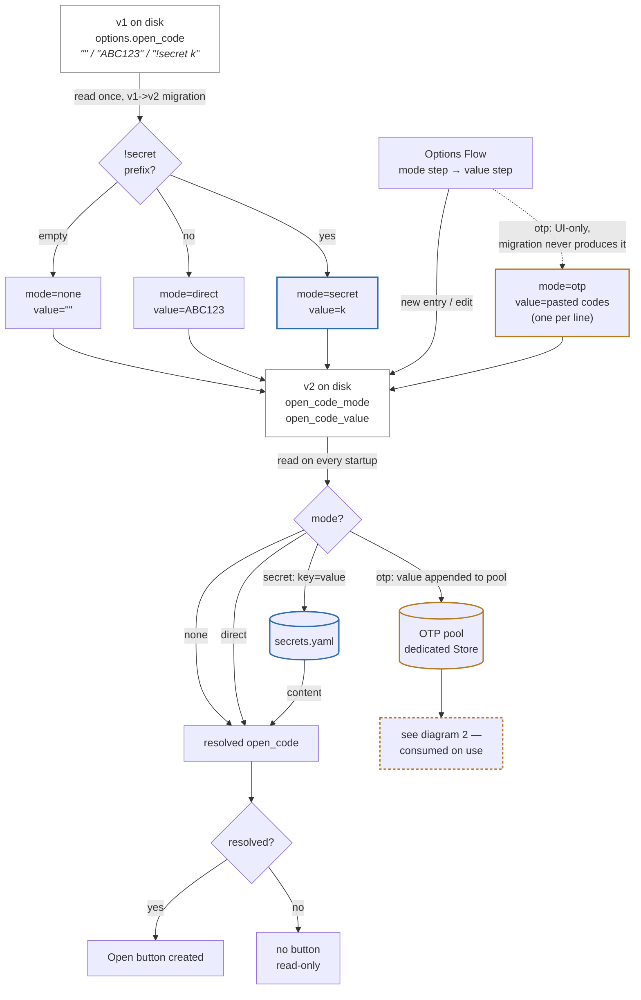
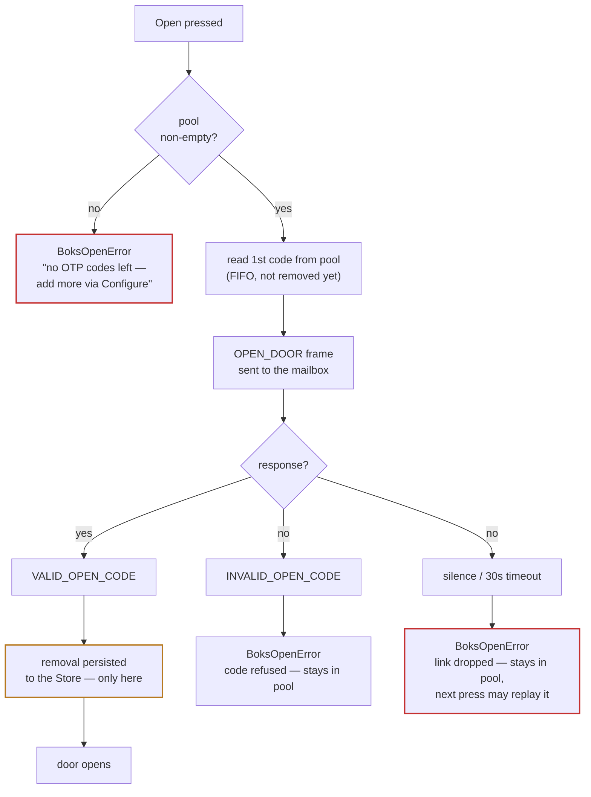

> 🇫🇷 **[Version française](docs/fr/TODO.md)**

# Roadmap / open subjects

Subjects still on the table. These are directions, not commitments or dates.
Contributions are welcome — one focused pull request per subject.

Guiding rule: the integration stays **read-only by default**. Any feature that
transmits more than a status request or an opt-in open command must stay behind
explicit user configuration and must never widen the transmit-opcode allowlist
silently.

---

## 1. Mifare NFC badge

**Goal.** Read, register and revoke Mifare NFC tags used to open the mailbox,
from Home Assistant.

**What we know.** The Boks protocol reserves opcodes for exactly this —
`REGISTER_NFC_TAG_SCAN_START` (23), `REGISTER_NFC_TAG` (24),
`UNREGISTER_NFC_TAG` (25) — with matching notifications (`NOTIFY_NFC_TAG_FOUND`,
`NOTIFY_NFC_TAG_REGISTERED`, …). The vendor SDK exposes `scanNFCTags()`,
`registerNfcTag()`, `unregisterNfcTag()`.

**What's needed.** These are administrative operations: they require the
owner's **Config Key** (retrievable from the account API), and they write to the
box. Implementing them means adding those opcodes to the allowlist *only when a
Config Key is configured*, mirroring how remote opening already gates on an open
code.

**Hardware.** NFC is **confirmed working on the reference box** — six Mifare
badges are in active use on it — even though it reports `Model Number = 2.0` and
exposes no Hardware Revision characteristic. So the SDK's "HW ≥ 4.0" note does
not preclude it here, and the feature can be developed and tested against real
hardware. Other hardware generations may still differ, so the feature should
detect capability rather than assume it.

**Status.** Read side shipped (*Last badge opening* sensor, v1.1.0). **Write side
IMPLEMENTED (v1.2.0)** — register/unregister/VIGIK behind the Config Key. The long
`225 UNAUTHORIZED` block turned out to be a **wrong frame format** inherited from
the community SDK (a spurious leading `0x00` that shifted the Config Key), not a
missing auth. Correct format reverse-engineered from the official app
(`com.boks.app`, `main.js`) and confirmed on the box (`SCAN_START → 199`, key
accepted). Not bonding, not SRP, not a dongle-only path. See
[docs/design/nfc-register.md](docs/design/nfc-register.md). **Remaining:**
end-to-end enrolment test on hardware, then a tagged release.

---

## 2. Vigik badge

**Goal.** Support the **Vigik** access badges used by La Poste (and utilities /
emergency services) to open building common areas and mailboxes.

**What we know.** The SDK defines a configuration type `BoksConfigType.LaPosteNfc`
applied through `SET_CONFIGURATION` (opcode 22). This strongly suggests Vigik /
La Poste postal access is a *configuration* of the box rather than an ordinary
user tag, and is therefore distinct from subject 1 above.

**What's needed.** Confirm, by observation, how a Vigik/La Poste credential is
provisioned over BLE and what `SET_CONFIGURATION` expects.

**Hardware.** Present on the reference box: its **keypad module was upgraded in
2025 to support Vigik badges**, and that same module is what enables the Mifare
NFC of subject 1. So the "HW ≥ 4.0" note is about this keypad/NFC module — here
retrofitted onto an otherwise `Model 2.0` box — and both badge subjects are
testable end-to-end on real hardware.

**Status.** IMPLEMENTED (v1.2.0) — a **VIGIK** switch, behind the Config Key,
sends `SET_CONFIGURATION` type `0x01` (LaPosteNfc). Same auth path as subject 1,
so unblocked by the same fix (correct frame format from the official app). The
switch is optimistic (the box does not expose VIGIK state over BLE); its exact
positive acknowledgement is still to be confirmed on hardware.

---

## 3. Bluetooth stack reliability

**Goal.** Fewer failed connections and clearer failure handling across the
`bleak` / `bleak-esphome` / `habluetooth` path.

**Open items.**

- **Weak-signal failures.** Through the mailbox's metal enclosure the link sits
  near −85 dBm; connection attempts occasionally fail and retry. The backoff is
  in place, but the temp-session open path (used when the link is not held) has
  only one real-world validation so far and deserves more.
- **`error=-2` root cause upstream.** The integration works around the ESPHome
  proxy advertising `REMOTE_CACHING` without honouring it (see
  [the troubleshooting section](README.md#gatt-cache-and-the-error-2-failure-mode))
  by clearing the GATT cache each session. The real fix belongs in the proxy
  firmware; a patch is prepared for upstream.
- ~~**Connection-interval negotiation.**~~ **Done in firmware v0.2.0**
  (`setConnectionParams`, 200-400 ms / latency 4, up from NimBLE's 30-50 ms /
  zero-latency default) — a measured ~10-30× cut in the mailbox's radio duty
  cycle while a link is held. **What it did not do:** fix the mailbox's
  Bluetooth LED staying lit while held (tested — the LED tracks link
  *presence*, not traffic). Why the vendor's own dongle avoids lighting it
  while holding its own link is still open; a link-layer pairing/bonding this
  proxy never initiates is the leading unconfirmed theory. Not pursued
  further yet — untested peripheral behaviour on an access-control device
  warrants care, ideally a way to observe the mailbox's reaction before
  attempting it live. See [README § Holding the link](README.md#holding-the-link).
- **Dependency pinning.** Track `bleak-esphome` / `aioesphomeapi` versions that
  are known-good against this box, so a Home Assistant update cannot silently
  regress the link.

**Status.** Ongoing, incremental.

---

## 4. Code hardening

**Goal.** Make the integration robust and maintainable enough for wider use.

**Open items.**

- **No test suite yet.** At minimum: frame build/parse round-trips, the
  opcode allowlist (it must keep refusing 16–19 / 22 / 32–33), PIN validation,
  door-state decoding, and the battery sag/plateau logic.
- **Value persistence across restart.** After a Home Assistant restart the
  sensors read `unavailable` until the first connection, because state lives in
  memory only. `RestoreEntity` on the sensors would keep the last known values,
  as already documented for the switches.
- **Config-flow / options-flow edge cases.** Cover a broken `!secret`
  reference, a removed secret key, and re-validation on reload.
- **HA quality-scale items.** Diagnostics download, reauth/reconfigure paths,
  strict typing, and CI running `hassfest` + `ruff`.

**Status.** Ongoing.

---

## 5. Dedicated config surface for the open code

**Goal.** Replace the single overloaded `open_code` option — one string that
means "no code", a raw code, or a `!secret <key>` reference depending on
what it starts with — with an explicit choice, and extend the same surface
to one-time-use (OTP) codes, which the current field cannot represent at
all (see below).

**What we know.** Feedback from a user of the public repo: after installing
the integration, it was not obvious that opening needs a separate step
(**Configure** → *Open code*) — fixed by pointing Installation straight at
[Opening the door](README.md#opening-the-door) (done, see the docs commit
history). The other half of that feedback — a dedicated file instead of
`!secret` — turned out, on inspection, to be better solved by making the
existing field's *shape* explicit than by inventing a new file format (see
Design). Separately, the README already documents that **one-time codes
exist and are not supported**: "the one-time codes the mobile app relays
would work exactly once" — the integration currently requires a permanent
code for exactly that reason.

**Design (drafted, not yet implemented).**

Split `open_code` into two options:

```python
CONF_OPEN_CODE_MODE  = "open_code_mode"   # "none" | "direct" | "secret" | "otp"
CONF_OPEN_CODE_VALUE = "open_code_value"  # meaning depends on mode
```

A 2-step Options Flow: step `init` (existing settings, unchanged) plus a
`SelectSelector` for the mode; if mode != `none`, step `open_code` shows one
field whose type and label follow the mode — masked single-line for
`direct`/`secret`, multiline ("one code per line") for `otp`.

Static modes (`none`/`direct`/`secret`) resolve to a single value once, at
`async_setup_entry`, exactly like today — just dispatched by an explicit
mode instead of sniffed from a string prefix:



`otp` breaks the symmetry of the other three modes: it does not resolve to
one value at startup, it feeds a pool that gets **consumed** one entry at a
time, tracked in a dedicated `homeassistant.helpers.storage.Store` (runtime
state, not user config — kept out of `config_entry.options`) keyed per
config entry. Submitting the options form in `otp` mode **appends** parsed,
validated codes to the existing pool; it never replaces it, so an unrelated
settings edit (keepalive, label) can't wipe a partially-consumed pool. The
field is always shown empty on the form — write-only, like the masked
fields, and for the same reason: no reason to ever redisplay a still-valid
single-use secret.

Consumption, at every **Open** press:



**Decided:** the pool removal happens **only on confirmed use**
(`VALID_OPEN_CODE`), not on send — a code is removed *because* the mailbox
used it, not because the integration attempted to. A refused code
(`INVALID_OPEN_CODE`) stays in the pool as-is: this integration does not
try to guess why it was refused. Residual risk, left open rather than
engineered around: if the response is lost to a link drop after the
mailbox actually accepted the code, the pool still shows it as available —
the next press replays it, which the mailbox will now answer with
`INVALID_OPEN_CODE` (safe: a loud, attributable failure, not a silent one),
costing one wasted press rather than one wasted code. No stale-entry
cleanup is planned for that case beyond what a user notices and removes by
hand.

Also needed: a diagnostic sensor (`sensor.boks_<id>_codes_otp_restants` /
*OTP codes remaining*) — without it the pool empties silently until the
first surprise failure.

**Status.** IMPLEMENTED (merged, unreleased — targets v1.2.0 alongside
subject 1). Modes, v1→v2 migration and the OTP pool (with its *Codes
remaining* diagnostic sensor) are all in `main`, together with an
unrelated Diagnostic **reboot button** (opcode 6, 60 s cooldown) merged in
the same window — see CHANGELOG.md. **Remaining:** none of this — modes,
OTP, or reboot — has been exercised against a real box yet; a field test
is the last gate before tagging a release.

*If you plan to work on any of these, opening an issue first avoids duplicate
effort — especially for subjects 1 and 2, whose protocol details still need to
be confirmed on real hardware.*
