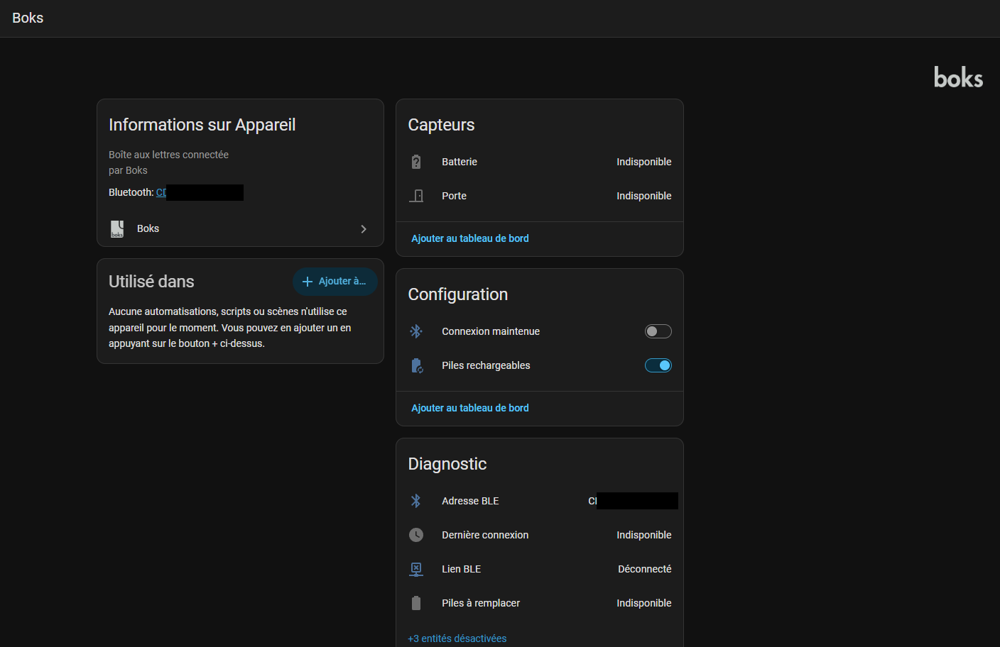

> 🇬🇧 **[English version](../../README.md)**

# Boks pour Home Assistant

Intégration Home Assistant pour la boîte aux lettres connectée **Boks**,
installable via [HACS](https://hacs.xyz/). **En lecture seule tant que vous
n'activez pas** l'ouverture à distance en renseignant un code — voir
[Périmètre](#périmètre).

La boîte est jointe en Bluetooth LE. Home Assistant est prévenu **à l'instant
où l'état de la porte change** — aucun polling.

| Entité | Type | Remarques |
|---|---|---|
| Porte | `binary_sensor` (`door`) | poussée par la boîte à chaque changement |
| Ouvrir | `button` | **seulement si un code d'ouverture est configuré** — voir [Ouvrir la porte](#ouvrir-la-porte) |
| Batterie | `sensor` (%) | poussée sur changement, lue à la connexion |
| Piles à remplacer | `binary_sensor` (`battery`) | diagnostic — **à utiliser plutôt que le pourcentage** ([pourquoi](#batterie--alcalines-ou-cellules-régulées)) |
| Connexion maintenue | `switch` | configuration — voir [Maintenir le lien](#maintenir-le-lien) |
| Piles rechargeables | `switch` | configuration — déclare le type de piles en place |
| Lien BLE | `binary_sensor` (`connectivity`) | diagnostic |
| Dernière connexion | `sensor` (horodatage) | diagnostic — dit de quand datent les valeurs ci-dessus |
| Adresse BLE | `sensor` | diagnostic |
| RSSI | `sensor` (dBm) | diagnostic, désactivé par défaut |
| Firmware / Software | `sensor` | diagnostic, désactivés par défaut |



> Home Assistant répartit la page de l'appareil par catégorie d'entité :
> *Capteurs* d'abord, puis *Configuration* (les deux switches), puis
> *Diagnostic*. Les deux switches ne sont donc **pas** dans le bloc Contrôles,
> qui ne reçoit que les entités sans catégorie.

## Périmètre

**Lecture seule par défaut.** En sortie de boîte, les seules trames émises sont
des **requêtes de statut**, qui servent aussi de keepalive (voir plus bas).
Aucun identifiant du propriétaire n'est requis ni utilisé, et aucune entité
`button` n'est créée.

**L'ouverture s'active volontairement.** Si — et seulement si — vous renseignez
un code d'ouverture dans les options, un bouton **Ouvrir** apparaît et
l'intégration peut en plus émettre `OPEN_DOOR`. Rien d'autre ne devient
possible pour autant : le constructeur de trames *refuse* tout autre opcode par
construction, de sorte que la gestion de codes (16-19), les changements de
configuration (22) et le provisioning (32-33) restent hors d'atteinte — pas
seulement inutilisés.

> Renseigner un code signifie que **quiconque a accès à votre Home Assistant
> peut ouvrir votre boîte aux lettres**. Le code est stocké dans l'entrée de
> configuration, en clair comme tout identifiant Home Assistant. Laissez le
> champ vide pour garder l'intégration strictement en lecture.

Voir [Ouvrir la porte](#ouvrir-la-porte).

## Prérequis

1. **Un proxy ou adaptateur Bluetooth à portée de la boîte**, déclaré dans Home
   Assistant. Un proxy sur pile **NimBLE** est fortement recommandé — voir
   [Pourquoi NimBLE](#pourquoi-nimble). Ce dépôt fournit un
   [firmware prêt à compiler](../../firmware/nimble-ble-proxy/) et son
   [guide de compilation](../../firmware/nimble-ble-proxy/README-FR.md).
2. **Le dongle officiel du fabricant doit être débranché.** Il maintient une
   connexion BLE permanente, ce qui rend la boîte invisible pour tout autre
   client, dont cette intégration.

## Installation

### 1. Firmware (une fois)

Compilez et flashez le proxy Bluetooth — voir **[firmware/nimble-ble-proxy/README-FR.md](../../firmware/nimble-ble-proxy/README-FR.md)** et
la **[spécification matérielle](hardware.md)**.

Ajoutez ensuite le proxy à Home Assistant : il s'annonce en mDNS et est détecté
par l'intégration **ESPHome** (API en clair, sans clé de chiffrement). C'est ce
qui permet à Home Assistant de router le Bluetooth vers la boîte.

### 2. Intégration (via HACS)

1. HACS → ⋮ → **Dépôts personnalisés** → ajoutez ce dépôt, catégorie
   **Intégration**.
2. Installez **Boks**, puis redémarrez Home Assistant.
3. **Paramètres → Appareils et services** : la boîte est détectée
   automatiquement (son UUID de service est déclaré dans le manifest). Sinon,
   *Ajouter une intégration → Boks*.

## Maintenir le lien

Le switch **Connexion maintenue** est l'arbitrage central de cette intégration,
et il vous appartient :

- **Allumé** — le lien GATT est tenu en permanence. Les changements d'état sont
  poussés à l'instant où ils se produisent, mais la boîte garde sa radio
  éveillée : sur un appareil à piles, cela se paie. Mesuré sur la nôtre :
  **58 % → 28 % en six jours**, piles retrouvées à plat. La diode Bluetooth de
  la boîte reste allumée pendant tout ce temps — c'est un moyen commode de
  vérifier.
- **Éteint** (par défaut) — aucune connexion. Les valeurs déjà connues restent
  affichées, et *Dernière connexion* dit de quand elles datent. La présence
  continue d'être suivie par les advertisements, qui ne coûtent rien à la boîte.

Deux réglages sont accessibles via **Configurer** sur l'entrée d'intégration,
et appliqués sans redémarrer Home Assistant :

| Réglage | Plage | Rôle |
|---|---|---|
| Intervalle de keepalive | 5–28 s | Principal levier de consommation quand le lien est tenu |
| Plafond de reconnexion | 30–900 s | Backoff quand la boîte est hors de portée |

Le keepalive est borné à 28 s volontairement : la boîte ferme la connexion au
bout d'environ **30 s** de silence. Au-delà, le lien tombe entre deux
keepalives et se reconnecte en boucle — ce qui coûte *plus* que de le tenir.

> Recharger l'entrée ne recharge **pas** le code Python de l'intégration, qui
> reste en cache dans le processus Home Assistant. Après une mise à jour des
> fichiers du composant, un redémarrage complet reste nécessaire.

## Ouvrir la porte

Ouvrir exige un secret, mais **pas** une session chiffrée : il n'y a aucun
handshake sur le lien Boks. La commande transporte simplement un PIN de
6 caractères que la boîte valide elle-même, en répondant `VALID_OPEN_CODE`
(129) ou `INVALID_OPEN_CODE` (130). Le secret est le code, pas le canal.

Renseignez-en un dans **Configurer** → *Code d'ouverture*. Il fait
6 caractères sur l'alphabet `0123456789AB` — douze symboles, donc `C` à `F` ne
sont **pas** valides. Le format est vérifié à l'enregistrement plutôt qu'à
l'appui : une trame mal formée peut être **ignorée par la boîte sans aucune
réponse**, ce qui est quasi indiagnosticable une fois en service.

Utilisez un code **permanent** — code maître ou code fixe de votre compte. Les
codes à usage unique que relaie l'application mobile ne fonctionneraient
qu'une seule fois.

Le bouton fonctionne **que le lien soit maintenu ou non** : s'il ne l'est pas,
une session temporaire est établie le temps de la commande puis relâchée. Un
bouton qui n'aurait marché qu'avec le lien déjà tenu serait inutilisable en
pratique, puisque ne pas le tenir est à la fois le défaut et le réglage
économe.

L'appui n'est réputé réussi qu'une fois la réponse `VALID_OPEN_CODE` reçue. Une
écriture GATT ne prouve rien à elle seule : un code refusé et une commande non
entendue se ressembleraient exactement.

## Batterie : alcalines ou cellules régulées

La boîte n'expose pas de tension. Elle publie la caractéristique standard
`0x2A19`, c'est-à-dire un pourcentage **qu'elle dérive elle-même** de la tension
du pack, sur une courbe d'alcaline (~1,6 V pleine → ~0,9 V vide). Ce chiffre n'a
donc de sens qu'avec des piles non régulées.

Les lithium rechargeables 1,5 V embarquent un convertisseur qui maintient 1,5 V
plat jusqu'à la coupure de leur protection. La jauge reste en haut d'échelle
pendant quasiment toute la durée de vie, puis s'effondre d'un coup — sans pente
d'avertissement. Dans un pack en série, la première cellule qui atteint son
seuil fait tomber l'ensemble : la panne est franche.

**Aucun recalcul ne peut corriger cela** : la tension d'un pack régulé ne porte
plus l'état de charge, et inventer une courbe produirait une jauge crédible et
fausse. Le switch **Piles rechargeables** change donc l'*interprétation*, pas la
valeur :

| | Alcalines (éteint) | Lithium régulées (allumé) |
|---|---|---|
| Le pourcentage | suit la charge restante | collé en haut d'échelle |
| Alerte piles faibles | seuil à 20 % | **décrochage** de 3 points sous le plateau observé |

Basculer le switch vaut déclaration d'un pack neuf : le plateau de référence est
remis à zéro. En automatisation, utilisez **Piles à remplacer** plutôt que le
pourcentage — un seuil fixe sur le pourcentage ne se déclencherait jamais avec
des cellules régulées.

Les creux de tension passagers sont filtrés : l'ouverture de la porte sollicite
le moteur et la boîte a déjà été vue publiant 0 % pendant la manœuvre. Une chute
franche n'est retenue qu'une fois confirmée par une seconde lecture.

## Pourquoi NimBLE

La boîte ferme toute connexion au bout d'environ **30 secondes** si le client
n'échange pas avec elle. Deux conséquences :

- **La pile BLE est déterminante.** Avec **Bluedroid** — la pile des proxys
  Bluetooth ESPHome standard — la découverte des services GATT n'aboutit jamais
  dans cette fenêtre sur cet appareil : la connexion est coupée avant d'avoir pu
  lire quoi que ce soit. Avec **NimBLE**, la découverte prend environ 6 secondes.
  Un hôte Linux BlueZ natif fonctionne également. D'où le choix de NimBLE pour
  le firmware de ce dépôt.
- **Un keepalive est indispensable.** L'intégration envoie périodiquement une
  requête de statut pour maintenir le lien ; sans elle, la boîte se déconnecte.
  C'est un comportement normal et attendu, pas un contournement de bug.

## Dépannage

| Symptôme | Cause probable |
|---|---|
| La boîte n'est jamais détectée | Dongle officiel encore branché, ou aucun proxy connectable à portée |
| Connexion puis coupure vers 30 s | Keepalive non actif — vérifiez les logs de l'intégration |
| Échecs de connexion fréquents | Signal faible. La boîte est un caisson métallique : visez la façade plastique, voir [matériel](hardware.md) |
| Entités *indisponibles* | Le lien BLE est tombé ; le capteur *Lien BLE*, lui, reste disponible et vous le signale |
| Une connexion échoue après un redémarrage, puis tout va bien | Normal : le cache GATT est purgé au premier essai (voir ci-dessous) |

Activer les logs de debug :

```yaml
logger:
  logs:
    custom_components.boks: debug
```

## Posture d'interopérabilité

Ce projet existe pour qu'un propriétaire de Boks puisse utiliser **son propre
appareil** avec **son propre** système domotique, en local. Il lit des
informations d'état que l'appareil expose sur des characteristics Bluetooth
standard et non authentifiées. Il ne contourne aucune mesure de sécurité,
n'extrait aucun secret et n'interagit pas avec les serveurs du fabricant.

## Crédits et licences

- Intégration Home Assistant et documentation : **GPL-3.0** (voir `LICENSE`).
- Firmware embarqué : travail tiers de **fl4p**, déclaré MIT — voir
  [`NOTICE.md`](../../firmware/nimble-ble-proxy/NOTICE.md) pour l'attribution,
  le commit upstream figé et l'unique correctif de portabilité appliqué.
