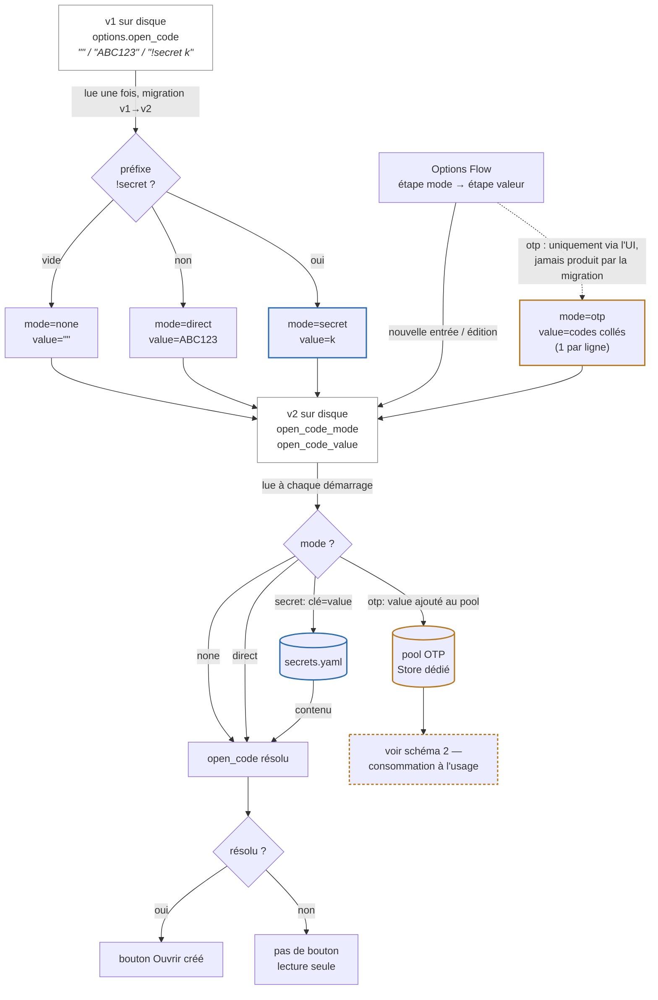
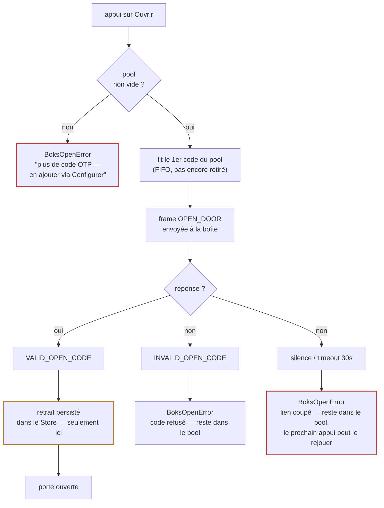

> 🇬🇧 **[English version](../../TODO.md)**

# Feuille de route / sujets ouverts

Sujets encore à traiter. Ce sont des directions, pas des engagements ni des
dates. Les contributions sont bienvenues — une pull request ciblée par sujet.

Règle directrice : l'intégration reste **en lecture seule par défaut**. Toute
fonction émettant plus qu'une requête de statut ou qu'une commande d'ouverture
volontaire doit rester derrière une configuration explicite de l'utilisateur, et
ne jamais élargir en silence la liste blanche des opcodes émis.

---

## 1. Badge NFC Mifare

**Objectif.** Lire, enregistrer et révoquer depuis Home Assistant les badges NFC
Mifare servant à ouvrir la boîte.

**Ce que l'on sait.** Le protocole Boks réserve des opcodes pour exactement
cela — `REGISTER_NFC_TAG_SCAN_START` (23), `REGISTER_NFC_TAG` (24),
`UNREGISTER_NFC_TAG` (25) — avec les notifications correspondantes
(`NOTIFY_NFC_TAG_FOUND`, `NOTIFY_NFC_TAG_REGISTERED`, …). Le SDK constructeur
expose `scanNFCTags()`, `registerNfcTag()`, `unregisterNfcTag()`.

**Ce qu'il faut.** Ce sont des opérations administratives : elles exigent la
**Config Key** du propriétaire (récupérable via l'API du compte) et écrivent
dans la boîte. Les implémenter suppose d'ajouter ces opcodes à la liste blanche
*uniquement lorsqu'une Config Key est configurée*, sur le modèle de l'ouverture
à distance déjà conditionnée à un code.

**Matériel.** Le NFC est **confirmé fonctionnel sur la boîte de référence** —
six badges Mifare y sont activement utilisés — alors même qu'elle renvoie
`Model Number = 2.0` et n'expose aucune characteristic Hardware Revision. La
mention « HW ≥ 4.0 » du SDK ne l'empêche donc pas ici, et la fonction peut être
développée et testée sur du vrai matériel. D'autres générations peuvent
néanmoins différer : la fonction devra détecter la capacité plutôt que la
supposer.

**État.** Lecture livrée (capteur « Dernière ouverture badge », v1.1.0).
**Écriture IMPLÉMENTÉE (v1.2.0)** — register/unregister/VIGIK derrière la Config
Key. Le long blocage sur `225 UNAUTHORIZED` était en fait un **mauvais format de
trame** hérité du SDK communautaire (un `0x00` parasite en tête qui décalait la
Config Key), pas une auth manquante. Format correct reversé de l'app officielle
(`com.boks.app`, `main.js`) et confirmé sur la boîte (`SCAN_START → 199`, clé
acceptée). Ni bonding, ni SRP, ni voie réservée au dongle. Voir
[docs/design/nfc-register.md](../design/nfc-register.md). **Reste :** test
d'enrôlement de bout en bout sur matériel, puis release taguée.

---

## 2. Badge Vigik

**Objectif.** Prendre en charge les badges **Vigik** utilisés par La Poste (et
les services / secours) pour ouvrir les parties communes et les boîtes aux
lettres.

**Ce que l'on sait.** Le SDK définit un type de configuration
`BoksConfigType.LaPosteNfc` appliqué via `SET_CONFIGURATION` (opcode 22). Cela
suggère fortement que l'accès postal Vigik / La Poste est une *configuration* de
la boîte plutôt qu'un badge utilisateur ordinaire, et qu'il est donc distinct du
sujet 1 ci-dessus.

**Ce qu'il faut.** Confirmer, par observation, comment un accès Vigik / La Poste
est provisionné en BLE et ce qu'attend `SET_CONFIGURATION`.

**Matériel.** Présent sur la boîte de référence : son **module clavier a été
upgradé en 2025 pour prendre en charge les badges Vigik**, et c'est ce même
module qui apporte le NFC Mifare du sujet 1. La mention « HW ≥ 4.0 » désigne donc
ce module clavier/NFC — ici ajouté en rétrofit sur une boîte par ailleurs
`Model 2.0` — et les deux sujets badges sont testables de bout en bout sur du
vrai matériel.

**État.** IMPLÉMENTÉ (v1.2.0) — un switch **VIGIK**, derrière la Config Key,
envoie `SET_CONFIGURATION` type `0x01` (LaPosteNfc). Même chemin d'auth que le
sujet 1, donc débloqué par le même correctif (bon format de trame issu de l'app
officielle). Le switch est optimiste (la boîte n'expose pas l'état VIGIK en BLE) ;
son accusé positif exact reste à confirmer sur matériel.

---

## 3. Fiabilisation de la couche Bluetooth

**Objectif.** Moins de connexions échouées et une gestion d'erreur plus claire
sur le chemin `bleak` / `bleak-esphome` / `habluetooth`.

**Points ouverts.**

- **Échecs à faible signal.** À travers le caisson métallique, le lien tourne
  autour de −85 dBm ; des tentatives de connexion échouent parfois et sont
  retentées. Le backoff est en place, mais le chemin d'ouverture par session
  temporaire (utilisé quand le lien n'est pas maintenu) n'a qu'une seule
  validation réelle à ce jour et mérite d'être éprouvé davantage.
- **Cause racine d'`error=-2` en amont.** L'intégration contourne le proxy
  ESPHome qui annonce `REMOTE_CACHING` sans l'honorer (voir la
  [section de dépannage](README.md#dépannage)) en
  vidant le cache GATT à chaque session. Le vrai correctif est dans le firmware
  du proxy ; un patch est préparé pour l'amont.
- ~~**Négociation de l'intervalle de connexion.**~~ **Fait en firmware v0.2.0**
  (`setConnectionParams`, 200-400 ms / latence 4, contre le défaut NimBLE de
  30-50 ms / latence nulle) — réduction mesurée d'un facteur ~10 à 30 du duty
  cycle radio de la boîte quand un lien est tenu. **Ce que ça n'a pas réglé :**
  la diode Bluetooth de la boîte reste allumée en continu quand le lien est
  tenu (testé — la diode suit la *présence* du lien, pas son trafic).
  Pourquoi le dongle du fabricant évite d'allumer la diode en tenant son
  propre lien reste ouvert ; un appariement (bonding) au niveau liaison que ce
  proxy n'initie jamais est l'hypothèse non confirmée la plus probable. Pas
  creusé davantage pour l'instant — un comportement de la boîte non testé sur
  un appareil de contrôle d'accès mérite de la prudence, idéalement un moyen
  d'observer sa réaction avant de le tenter en direct. Voir
  [README § Maintenir le lien](README.md#maintenir-le-lien).
- **Épinglage des dépendances.** Suivre les versions de `bleak-esphome` /
  `aioesphomeapi` connues comme bonnes contre cette boîte, pour qu'une mise à
  jour de Home Assistant ne régresse pas le lien en silence.

**État.** En cours, incrémental.

---

## 4. Fiabilisation du code

**Objectif.** Rendre l'intégration assez robuste et maintenable pour un usage
plus large.

**Points ouverts.**

- **Pas encore de suite de tests.** Au minimum : allers-retours
  construction/décodage de trames, la liste blanche d'opcodes (elle doit
  continuer de refuser 16-19 / 22 / 32-33), la validation des PIN, le décodage
  de l'état de porte, et la logique de creux/plateau de batterie.
- **Persistance des valeurs au redémarrage.** Après un redémarrage de Home
  Assistant, les capteurs affichent `unavailable` jusqu'à la première connexion,
  car l'état ne vit qu'en mémoire. `RestoreEntity` sur les capteurs conserverait
  les dernières valeurs connues, comme déjà documenté pour les switches.
- **Cas limites des config/options flow.** Couvrir une référence `!secret`
  cassée, une clé de secret supprimée, et la re-validation au rechargement.
- **Éléments de quality-scale HA.** Téléchargement des diagnostics, chemins
  reauth/reconfigure, typage strict, et CI exécutant `hassfest` + `ruff`.

**État.** En cours.

---

## 5. Surface de configuration dédiée pour le code d'ouverture

**Objectif.** Remplacer l'option unique `open_code` — une chaîne qui
signifie « pas de code », un code brut, ou une référence `!secret <clé>»
selon ce par quoi elle commence — par un choix explicite, et étendre cette
même surface aux codes à usage unique (OTP), que le champ actuel ne peut
pas du tout représenter (voir plus bas).

**Ce que l'on sait.** Retour d'un utilisateur du dépôt public : après avoir
installé l'intégration, ce n'était pas évident qu'ouvrir nécessite une
étape séparée (**Configurer** → *Code d'ouverture*) — corrigé en pointant
Installation directement vers
[Ouvrir la porte](README.md#ouvrir-la-porte) (fait, voir l'historique des
commits de doc). L'autre moitié de ce retour — un fichier dédié plutôt que
`!secret` — s'est avérée, après examen, mieux résolue en rendant explicite
la *forme* du champ existant qu'en inventant un nouveau format de fichier
(voir Conception). Par ailleurs, le README documente déjà que **les codes
à usage unique existent et ne sont pas supportés** : « les codes à usage
unique que relaie l'application mobile ne fonctionneraient qu'une seule
fois » — l'intégration exige aujourd'hui un code permanent précisément
pour cette raison.

**Conception (ébauchée, pas encore implémentée).**

Séparer `open_code` en deux options :

```python
CONF_OPEN_CODE_MODE  = "open_code_mode"   # "none" | "direct" | "secret" | "otp"
CONF_OPEN_CODE_VALUE = "open_code_value"  # le sens dépend du mode
```

Un Options Flow en 2 étapes : étape `init` (réglages existants, inchangés)
plus un `SelectSelector` pour le mode ; si mode ≠ `none`, étape `open_code`
affichant un champ dont le type et le libellé suivent le mode — masqué
sur une ligne pour `direct`/`secret`, multiligne (« un code par ligne »)
pour `otp`.

Les modes statiques (`none`/`direct`/`secret`) se résolvent en une seule
valeur, une fois, à `async_setup_entry`, exactement comme aujourd'hui —
juste dispatchés par un mode explicite plutôt que reniflés depuis un
préfixe de chaîne :



`otp` casse la symétrie des trois autres modes : il ne se résout pas à une
valeur unique au démarrage, il alimente un pool **consommé** un élément à
la fois, suivi dans un `homeassistant.helpers.storage.Store` dédié (état
d'exécution, pas de la config utilisateur — gardé hors de
`config_entry.options`), par entrée de configuration. Soumettre le
formulaire en mode `otp` **ajoute** les codes analysés et validés au pool
existant ; ça ne le remplace jamais, pour qu'une modification de réglage
sans rapport (keepalive, label) ne puisse pas effacer un pool partiellement
consommé. Le champ est toujours affiché vide dans le formulaire — en
écriture seule, comme les champs masqués, et pour la même raison : aucune
raison de jamais réafficher un secret à usage unique encore valide.

Consommation, à chaque appui sur **Ouvrir** :



**Tranché :** le retrait du pool a lieu **uniquement après usage confirmé**
(`VALID_OPEN_CODE`), pas à l'envoi — un code est retiré *parce que* la
boîte l'a utilisé, pas parce que l'intégration a tenté de l'utiliser. Un
code refusé (`INVALID_OPEN_CODE`) reste dans le pool tel quel :
l'intégration n'essaie pas de deviner pourquoi il a été refusé. Risque
résiduel, laissé ouvert plutôt que contourné artificiellement : si la
réponse est perdue suite à une coupure de lien après que la boîte ait
réellement accepté le code, le pool continue de le montrer comme
disponible — le prochain appui le rejoue, et la boîte répondra alors
`INVALID_OPEN_CODE` (sans danger : un échec bruyant et attribuable, pas
silencieux), au prix d'un appui gaspillé plutôt que d'un code gaspillé.
Aucun nettoyage automatique d'entrée obsolète n'est prévu pour ce cas,
au-delà de ce qu'un utilisateur remarque et retire lui-même.

À prévoir aussi : un capteur de diagnostic
(`sensor.boks_<id>_codes_otp_restants` / *Codes OTP restants*) — sans lui,
le pool s'épuise en silence jusqu'au premier échec surprise.

**État.** Conception ébauchée (cette entrée), pas implémentée. Bloqué sur :
(a) la validation par quelqu'un de l'arbitrage retrait-à-l'envoi vs
retrait-à-la-confirmation ci-dessus, (b) la revue normale une fois le code
écrit — comme tout changement de config-flow, alimente au passage les cas
de test déjà prévus au sujet 4 (« cas limites des config/options flow »).

*Si vous comptez travailler sur l'un de ces sujets, ouvrir une issue au
préalable évite les efforts en double — surtout pour les sujets 1 et 2, dont les
détails protocolaires restent à confirmer sur du matériel réel.*
