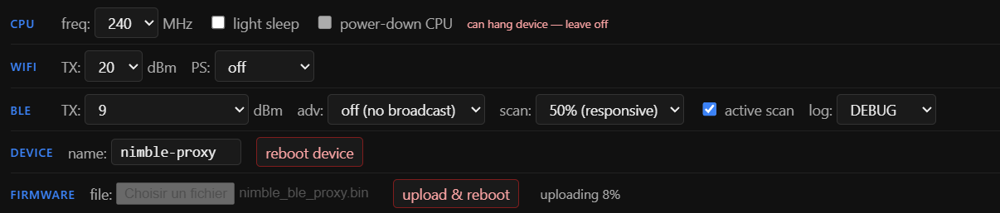
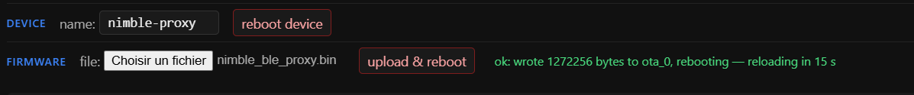

> 🇬🇧 **[English version](README.md)**

# Compiler et installer le proxy Bluetooth — pas à pas

Ce dossier contient le firmware qui permet à Home Assistant de dialoguer avec la
boîte aux lettres. Il tourne sur un **ESP32-S3** et se présente à Home Assistant
comme un **proxy Bluetooth ESPHome** standard — mais sur la pile **NimBLE** au
lieu de Bluedroid, ce qui est précisément ce qui rend cette boîte joignable.

Cette opération se fait **une fois**, avant d'installer l'intégration Home
Assistant. Comptez 30 à 45 minutes la première fois, dont l'essentiel pour
installer ESP-IDF.

| | |
|---|---|
| Origine | [`fl4p/nimble-ble-proxy-esphome`](https://github.com/fl4p/nimble-ble-proxy-esphome), commit épinglé — voir [`NOTICE.md`](NOTICE.md) |
| Documentation technique de l'auteur | [`README-DETAIL.md`](README-DETAIL.md) — architecture, protocole, choix de conception |
| Matériel à acheter et ses pièges | [`../../docs/fr/hardware.md`](../../docs/fr/hardware.md) |

> **`README-DETAIL.md` est le document de l'auteur amont**, conservé tel quel. Il
> explique le fonctionnement interne du firmware. Le guide que vous lisez est le
> nôtre et se limite à le compiler et le mettre en service.

---

## A. Ce qu'il faut configurer

Étonnamment peu de choses — **deux valeurs** :

| Paramètre | Valeur | Où |
|---|---|---|
| SSID WiFi | le nom de votre réseau **2,4 GHz** | `include/wifi_creds.h` |
| Mot de passe WiFi | celui de ce réseau | `include/wifi_creds.h` |

Deux malentendus fréquents, autant les lever tout de suite :

- **L'adresse Bluetooth de la boîte ne se configure _pas_ ici.** Le firmware est
  un proxy générique : il relaie ce que Home Assistant lui demande. L'adresse de
  la boîte se choisit plus tard, dans Home Assistant, au moment d'ajouter
  l'intégration Boks — elle y est même détectée automatiquement.
- **Le 2,4 GHz est obligatoire.** L'ESP32-S3 n'a pas de radio 5 GHz. Si votre
  point d'accès diffuse les deux bandes sous un même SSID, ce n'est pas un
  problème : la carte s'associera en 2,4 GHz.

Optionnel et modifiable ensuite sans reflasher : le nom d'hôte de l'appareil
(`nimble-proxy` par défaut), via `POST /hostname?val=...`.

---

## B. Récupérer les sources, puis renseigner les paramètres

### B.1 — Cloner le dépôt

Tout ce qui suit s'exécute depuis le répertoire du firmware : commencez donc
par là, cela rend chaque commande ultérieure sans ambiguïté :

```bash
git clone https://github.com/kamahat/skob-ha.git
cd skob-ha/firmware/nimble-ble-proxy
```

Vous devez maintenant voir `CMakeLists.txt`, `main/`, `components/` et
`include/` dans le répertoire courant :

```bash
ls
# CMakeLists.txt  components  include  main  partitions.csv  sdkconfig.defaults  ...
```

**Restez dans ce répertoire pour tout le reste du guide.**

### B.2 — Renseigner les identifiants WiFi

Le fichier d'identifiants n'existe pas encore : le dépôt fournit un modèle, et
le vrai fichier est volontairement ignoré par git pour que votre mot de passe ne
se retrouve jamais dans un commit :

```bash
cp include/wifi_creds.h.example include/wifi_creds.h
```

Éditez ensuite `include/wifi_creds.h`. Il doit ressembler à ceci :

```c
#pragma once

#define WIFI_SSID     "mon-reseau-iot"
#define WIFI_PASSWORD "mon-mot-de-passe"
```

Voilà toute la configuration. Tout le reste a une valeur par défaut correcte.

---

## C. Compilation

### C.1 — Installer les outils

| Outil | Version | Remarques |
|---|---|---|
| **ESP-IDF** | **v5.5** (toute 5.x devrait convenir) | [guide d'installation officiel](https://docs.espressif.com/projects/esp-idf/en/v5.5/esp32s3/get-started/) |
| **git** | quelconque | pour récupérer une dépendance |
| **Python** | fourni avec ESP-IDF | un seul paquet à ajouter |

ESP-IDF apporte son propre compilateur, son propre environnement Python et
`esptool` : il n'y a rien d'autre à installer à la main.

**Toutes les commandes ci-dessous doivent tourner dans un shell ESP-IDF**,
c'est-à-dire après avoir chargé l'environnement :

```bash
. ~/esp/esp-idf/export.sh          # Linux / macOS
```
```powershell
. $env:USERPROFILE\esp\esp-idf\export.ps1   # Windows PowerShell
```

C'est bon quand `idf.py --version` répond.

### C.2 — Récupérer nanopb

Les liaisons protobuf sont générées à la compilation par **nanopb**, qui n'est
pas embarqué ici (il a sa propre licence). Clonez-le exactement là où la
compilation l'attend :

```bash
cd components/api_proto
git clone --depth 1 https://github.com/nanopb/nanopb.git nanopb
cd ../..          # retour dans firmware/nimble-ble-proxy
```

La compilation de référence utilisait le commit nanopb
`d21fa5084287ab67da2f166f4def045bedcb535e`.

Si vous sautez cette étape, la compilation s'arrête tôt avec un message qui le
dit explicitement : `nanopb not vendored at …`.

### C.3 — Ajouter l'unique paquet Python

```bash
pip install protobuf
```

Lancez-le **dans l'environnement ESP-IDF** (après `export.sh`/`export.ps1`),
pour qu'il s'installe dans le venv d'IDF et non dans votre Python système.

### C.4 — Choisir la puce — dans une commande à part

```bash
idf.py set-target esp32s3
```

Puis **vérifiez que ça a bien pris** :

```bash
grep CONFIG_IDF_TARGET= sdkconfig
# attendu : CONFIG_IDF_TARGET="esp32s3"
```

> ⚠️ **N'enchaînez pas cette commande avec la compilation.** Si `set-target` est
> combiné à une compilation qui échoue pendant la *configuration* (un nanopb
> manquant, par exemple), la cible reste silencieusement à la valeur par défaut
> `esp32`. Toutes les compilations suivantes *réussissent* alors en produisant
> une image pour la mauvaise puce, et vous ne le découvrez qu'au flash :
>
> ```
> A fatal error occurred: This chip is ESP32-S3, not ESP32. Wrong --chip argument?
> ```
>
> Si cela arrive : `idf.py fullclean`, puis refixez la cible et revérifiez.

### C.5 — Compiler

```bash
idf.py build
```

La première compilation prend plusieurs minutes (elle compile ESP-IDF lui-même
et télécharge le composant NimBLE). Les suivantes prennent quelques secondes.
Une compilation réussie se termine par :

```
Project build complete. To flash, run:
 idf.py flash
nimble_ble_proxy.bin binary size 0x139300 bytes.
Smallest app partition is 0x1e0000 bytes. 0xa6d00 bytes (35%) free.
```

Le firmware se trouve alors dans `build/nimble_ble_proxy.bin` — environ
**1,28 Mo**.

---

### C.6 — Donner un nom versionné au binaire

`idf.py build` écrit toujours au même endroit : au bout de quelques
compilations, les binaires deviennent indiscernables. Copiez-le sous un nom
qui dit lequel c'est :

```bash
cp build/nimble_ble_proxy.bin    build/nimble_ble_proxy-0.1.0-$(date +%Y%m%d-%H%M).bin
```

Ce détail compte plus qu'il n'y paraît. **Ne vous fiez pas à la date de
compilation affichée en pied de tableau de bord ni renvoyée par
`GET /appinfo` pour savoir quel firmware tourne** : ESP-IDF ne régénère cette
chaîne que si l'unité de compilation qui la porte est recompilée. Après un
build incrémental, elle peut donc annoncer un horodatage plus ancien alors
qu'une image plus récente s'exécute réellement. Le nom de fichier versionné
est la trace fiable.

Pour vérifier ce qu'une carte exécute vraiment, cherchez une modification que
vous avez faite — par exemple récupérez `/` et vérifiez la présence d'un
élément que vous avez ajouté — plutôt que de croire la date annoncée.

---

## D. Vérifier le firmware avant de le flasher

Trois contrôles rapides évitent les erreurs pénibles à diagnostiquer ensuite.

**1. La bonne pile BLE** — c'est toute la raison d'être de ce firmware :

```bash
grep -E "CONFIG_BT_(NIMBLE|BLUEDROID)_ENABLED" sdkconfig
```
```
CONFIG_BT_NIMBLE_ENABLED=y
# CONFIG_BT_BLUEDROID_ENABLED is not set     ← Bluedroid doit être absent
```

Si Bluedroid apparaît ici, la compilation se comportera avec cette boîte aux
lettres exactement comme le proxy ESPHome standard, c'est-à-dire mal.

**2. La bonne puce :**

```bash
grep CONFIG_IDF_TARGET= sdkconfig
# CONFIG_IDF_TARGET="esp32s3"
```

**3. Le binaire existe et a une taille plausible :**

```bash
ls -l build/nimble_ble_proxy.bin       # ~1,3 Mo
```

La vérification après flash se trouve en section **E.4**.

---

## E. Installer sur l'ESP32-S3

### E.1 — Choisir le bon port USB

La plupart des cartes de développement ESP32-S3 exposent **deux ports USB-C**,
et c'est le piège qui attrape presque tout le monde :

| Port | Sérigraphie | À utiliser ? |
|---|---|---|
| Pont USB-série (CP210x, CH343…) | souvent `COM` ou `UART` | ✅ **oui** — l'auto-reset fonctionne, le flash se déroule tout seul |
| USB natif de la puce | souvent `USB` | ⚠️ à éviter pour le premier flash |

Branchez sur le port **`COM`/UART** et vérifiez qu'un périphérique série est
apparu :

```bash
ls /dev/ttyUSB* /dev/ttyACM*          # Linux
ls /dev/cu.*                          # macOS
```
```powershell
Get-CimInstance Win32_SerialPort | Select-Object DeviceID, Description   # Windows
```

Vous cherchez une ligne nommant un pont série, par exemple
`USB-Enhanced-SERIAL CH343 (COM12)` ou `/dev/ttyUSB0`.

*Rien n'apparaît ?* Essayez d'abord un autre câble USB : les câbles de charge
seule, sans fils de données, sont de très loin la cause la plus fréquente.

### E.2 — Flasher

```bash
idf.py -p /dev/ttyUSB0 flash        # Linux
idf.py -p /dev/cu.usbserial-110 flash   # macOS
idf.py -p COM12 flash               # Windows
```

Cette commande écrit le bootloader, la table de partitions et le firmware.
Comptez environ une minute, avec pour conclusion :

```
Hash of data verified.
Leaving...
Hard resetting via RTS pin...
```

*En cas d'échec « Failed to connect … No serial data received »*, passez la
carte en mode téléchargement à la main : **maintenez `BOOT`, appuyez brièvement
sur `RST`, relâchez `BOOT`**, puis relancez la commande de flash.

### E.3 — Observer le démarrage

```bash
idf.py -p COM12 monitor        # Ctrl-] pour quitter
```

Un premier démarrage sain affiche, dans cet ordre :

```
nimble-ble-proxy 0.1.0 booting
wifi: connected, IP 192.168.1.42
mdns: _esphomelib._tcp on nimble-proxy:6053 announced
ota: OTA endpoint at http://nimble-proxy.local/update
ble: NimBLE ready (max_conn=4, scan=30ms/60ms)
```

**Notez l'adresse IP** — les étapes suivantes s'en servent.

*La carte redémarre en boucle ?* Cherchez `Guru Meditation Error` dans le
journal ; sur les cartes bon marché, le coupable habituel est une incohérence de
PSRAM, traitée dans [hardware.md](../../docs/fr/hardware.md).

### E.4 — Vérifier qu'il tourne vraiment

Depuis n'importe quelle machine du même réseau :

```bash
curl http://192.168.1.42/stats.json
```
```json
{"adverts":335,"heap":61660,"temp_c":44.5,"ble":true,"connections":0}
```

`"ble": true` et un compteur `adverts` qui monte signifient que la partie
Bluetooth est vivante. Le tableau de bord web sur `http://192.168.1.42/` montre
la même chose, plus chaque appareil vu avec sa puissance de signal — c'est
l'outil qu'il vous faut pour choisir l'emplacement de la carte.

### E.5 — À propos du mode routeur WiFi

Rien à faire. Le firmware sait aussi faire point d'accès WiFi et routeur, et
l'amont le livre **activé** ; il est désactivé **à la compilation** dans cette
copie (`CONFIG_NBP_NAT_ROUTER=n` dans `sdkconfig.defaults`).

C'est délibéré : ici la carte n'est qu'un pont, et un point d'accès vole du
temps d'antenne au Bluetooth sur l'unique radio 2,4 GHz — il fait aussi pencher
l'arbitre de coexistence du côté du WiFi, et coûte de la flash et de la DRAM sur
une carte sans PSRAM.

Si vous y tenez malgré tout, passez `CONFIG_NBP_NAT_ROUTER=y` et recompilez.

> Si vous utilisez d'autres endpoints de configuration, sachez qu'ils exigent
> **`curl -X POST`**. Un `curl` nu effectue un GET et se contente de relire la
> valeur sans rien appliquer — une demi-heure vite perdue.

### E.6 — Les mises à jour suivantes passent par le WiFi

Une fois le firmware sur la carte, le câble n'est plus nécessaire. Recompilez,
puis mettez à jour au choix :

**Depuis le tableau de bord** — ouvrez `http://192.168.1.42/`, repérez le
groupe **firmware** parmi les réglages en haut de page, sélectionnez votre
fichier `.bin` et cliquez sur **upload & reboot**. Une confirmation est
demandée d'abord, puisque le flash redémarre la carte.

Pendant l'envoi, les contrôles se verrouillent et la progression s'affiche :



Une fois l'image écrite, la carte répond puis redémarre ; la page se recharge
d'elle-même quelques secondes plus tard :



**Depuis un terminal** — pour les mises à jour scriptées :

```bash
idf.py build
curl --data-binary @build/nimble_ble_proxy.bin http://192.168.1.42/update
```
```
ok: wrote 1284496 bytes to ota_1, rebooting
```

Dans les deux cas la carte redémarre seule sur le nouveau firmware, et Home
Assistant se reconnecte sans intervention — comptez quelques secondes de
coupure.

> Le contrôle de téléversement n'apparaît que si vous atteignez le tableau de
> bord en HTTP. La même page peut être servie via Web Bluetooth, qui ne peut pas
> transporter une image de plusieurs mégaoctets : le contrôle y est donc masqué
> plutôt que proposé et voué à l'échec.

---

## Ajouter le proxy à Home Assistant

Le firmware s'annonce en mDNS comme un appareil ESPHome. Home Assistant le
détecte dans **Paramètres → Appareils et services** ; confirmez-le — l'API est
en clair, il n'y a donc aucune clé de chiffrement à saisir.

Une fois ajouté, il s'enregistre comme scanner Bluetooth, et *c'est cela* qui
permet à l'intégration Boks d'atteindre la boîte. Sans cette étape,
l'intégration ne la trouvera jamais, si bien installée soit-elle.

---

## Endpoints utiles

| Endpoint | Rôle |
|---|---|
| `GET /` | Tableau de bord web |
| `GET /stats.json` | Santé : mémoire, température, compteurs BLE |
| `GET /devices` | Appareils vus avec leur RSSI — pour choisir l'emplacement |
| `GET /log?since=0` | Journal du firmware, à distance |
| `POST /level?nimble=<0..5>` | Verbosité des journaux NimBLE |
| `POST /update` | Mise à jour OTA |
| `POST /reboot` | Redémarrage |

## Dépannage

| Symptôme | Cause |
|---|---|
| `nanopb not vendored at …` | Étape **C.2** oubliée |
| `Python was not found` (Windows) | Vous n'êtes pas dans un shell ESP-IDF — voir **C.1** |
| `This chip is ESP32-S3, not ESP32` | Cible non fixée — voir l'avertissement en **C.4** |
| `Failed to connect … No serial data received` | Mauvais port USB (**E.1**), ou passer en mode téléchargement manuel (**E.2**) |
| Aucun port série n'apparaît | Câble USB de charge seule, ou pilote du pont manquant |
| Redémarrages en boucle avec `Guru Meditation` | En général la PSRAM — voir [hardware.md](../../docs/fr/hardware.md) |
| Home Assistant ne le découvre jamais | mDNS bloqué entre VLAN ; ajoutez l'appareil par son IP |
